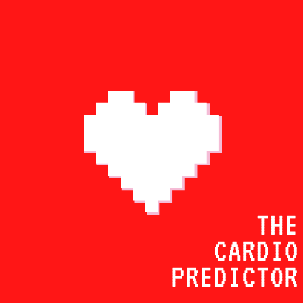
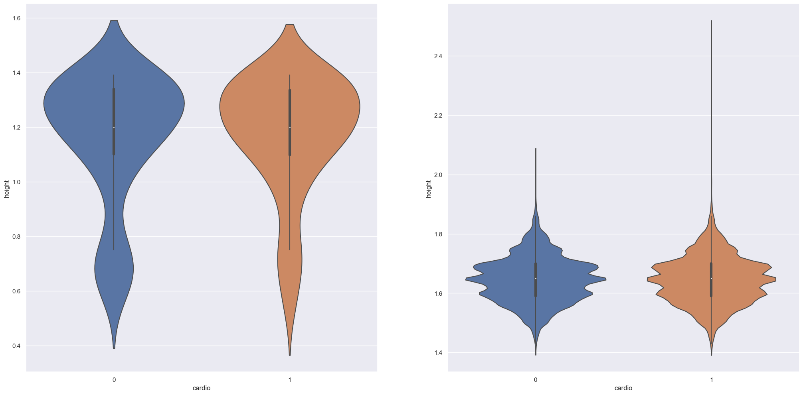
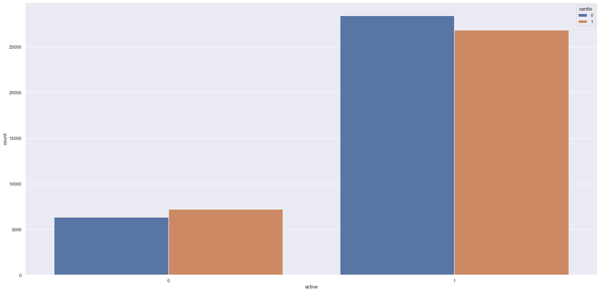
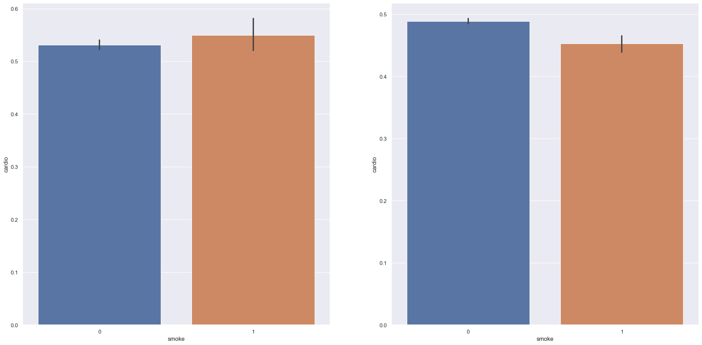

# The Cardio Predictor: A Data Science Project for Cardiovascular Disease Detection
<H1 align="center">
  
</H1>
<H3 align ="right"> Project made by Pablo Gomes de Miranda</H3>

## Overview:
The Cardio Predictor is a company that specializes in detecting cardiovascular diseases at an early stage, offering diagnostics at a certain price. Currently the diagnostics are performed manually and the precision offered by the diagnostics is between 55% and 60% due to the complexity of this diagnosis and the exhaustion of the company's technical staff. Thus, we were hired by the company to develop a solution with Machine Learning that implies in more precise diagnoses, relieving the workload of the technical staff that can engage in other activities related to the company, which with access to a model of higher precision, will also have an increase in its revenue. In the end, we achieve a classification model that in the **Worst Case Scenario**, with 72% of Precision, can bring a return of **US$ 175,000,000.00**, and in the **Best Case Scenario**, with a 78% of Precision, it can be expected a profit of **US$ 210,000,000.00**.

## Tools Used:
- Python 3.10.8;
- VS Code;
- Jupyter Notebook;
- Git and Github;

## Final Product:
The report will be made in person.

**Disclaimer**: "The Cardio Predictor" is a fictitious company, created for the purpose of giving context to this challenge. Additionally, the data, as well as their description, was taken from [**Kaggle**](https://www.kaggle.com/datasets/sulianova/cardiovascular-disease-dataset), and is based on the collection of 70000 actual diagnoses (collected at the moment of medical examination).

# 1. Business Problem:
The Cardio Predictor is a medium-sized company offering diagnostic services for cardiovascular diseases at a price based on the precision of their diagnoses. They hired us to develop a better prediction model than the one currently used in the company, which is done manually and overwhelms their specialists. In terms of pricing, diagnostics are performed for an average price of US$1000.00 to US$1500.00 for a prediction with 55% or 60% precision. Each diagnosis costs this much because it includes the devices used for the examination and the payroll of the analysts. 

However this price varies around the precision of the diagnosis:
- For a diagnosis with 50% precision, a fee of US$500 is charged.
- For each 5% precision, an additional US$500 is charged.
- For a diagnosis with less than 50% precision, the company does not charge for the service.

The variation of the precision given by the team of specialists, makes the company to have an operation with profit, with revenue exceeding the cost, and an operation with loss, with revenue less than the cost. This instability of the diagnosis causes the company to have an unpredictable Cashflow. 

## Objectives: 
1. To create a tool that will increase the precision of diagnosis and make it stable for all diagnoses. 
2. A report to the CEO of the company informing about the results and answering the following questions:
    - What is the accuracy and precision of the tool?
    - How much profit will the company make with the new tool?
    - How reliable is the result given by the new tool?
    
# 2. Business Assumptions:

### There are 3 types of input features:

- Objective: factual information;
- Examination: results of medical examination;
- Subjective: information given by the patient.

### Features:

- Age | Objective Feature | age | int (days)
- Height | Objective Feature | height | int (cm) |
- Weight | Objective Feature | weight | float (kg) |
- Gender | Objective Feature | gender | categorical code |
- Systolic blood pressure | Examination Feature | ap_hi | int |
- Diastolic blood pressure | Examination Feature | ap_lo | int |
- Cholesterol | Examination Feature | cholesterol | 1: normal, 2: above normal, 3: well above normal |
- Glucose | Examination Feature | gluc | 1: normal, 2: above normal, 3: well above normal |
- Smoking | Subjective Feature | smoke | binary |
- Alcohol intake | Subjective Feature | alco | binary |
- Physical activity | Subjective Feature | active | binary |
- Presence or absence of cardiovascular disease | Target Variable | cardio | binary |

Once more, the data, as well as their description, was taken from the **Kaggle** database and is based on the collection of 70000 actual diagnoses (collected at the moment of medical examination), the link to the dataset, as well as the description of the data, follows below:

https://www.kaggle.com/datasets/sulianova/cardiovascular-disease-dataset

# 3. Solution Strategy
My strategy to solve this challenge was:

**Step 01. Data Description:** in the first approach to the dataset we try to find out its dimensions, the types of data, look for missing data and perform a first exploration of descriptive statistics.

**Step 02. Feature Engineering:** with the help of a [mind map](./reports/figures/map_cardio.png), we elaborated a list of hypotheses to be tested later, but that served to make it possible to realize which features could be interesting for this project: a feature that calculated the users' Body Mass Index (BMI) and another feature calculating their Blood Pressure.

**Step 03. Data Filtering:** we filtered out only data that were very discrepant from the rest of the data, outliers that were not only out of sync with the rest of the data, but also measurements impossible to find in a human being.

**Step 04. Exploratory Data Analysis:** we conducted an in-depth exploration of the data, performing univariate, bivariate and multivariate analysis of the data. The univariate analysis was important for us to understand the distribution of each of the features. The bivariate analysis served to understand the relationship of each feature with the target variable, and to validate the previously formulated hypotheses. The multivariate analysis served as a support to understand how the features were correlated.

**Step 05. Data Preparation:** the rescaling was done with MinMaxScaler on all features, except when the outliers present made it necessary to apply RobustScaler (we used StandardScaler in a previous test, but the tests returned a loss on the selected metrics). Part of the categorical features were already in an ordinal classification, and it was not necessary to apply an encoder, but for the other features, the LabelEncoder was used.

**Step 06. Feature Selection:** the data was split into training, testing and validation sets, and in addition to manual feature selection, selection was done with the help of the Boruta algorithm and decision tree models.

**Step 07. Machine Learning Modelling:** the training dataset was used to train different machine learning models. Although our baseline was defined in the business problem (55% accuracy), we trained a baseline model to be used as a reference. The following classification models were trained: Logistic Regression, Support Vector Machine, k-Nearest Neighbors, Decision Tree, Random Forest, XGBoost and LightGBM. Although the business problem mentions Accuracy as the desired metric, the truth is that high accuracy can mean a high False Negative rate, something that is not desired for a model aimed at heart disease prediction. So, when plotting confusion matrices, we look for the model with the best F1-Score, the harmonic mean between Precision and Recall.

**Step 08. Hyperparameter Fine Tunning:** the model selected was LightGBM. The Fine Tuning was performed using GridSearchCV in order to find the best parameters that could improve the Precision metric while also performing Cross-Validation.

**Step 09. Convert Model Performance to Business Values:** finally, the Precision score was used to translate the results of the model's performance into the expected profit. We were told that every 5% in the model's performance is translated as a plus US$500.00 profit, so, according to the final performance, we calculated a worst and best scenario with a Precision of 0.75(+/- 0.03).

# 4. Top 3 Data Insights
**Hypothesis 01:** people with Dwarfism condition are not necessarily prone to develop cardiovascular diseases.

**True:** although our data indicate that indeed, individuals with dwarfism are not necessarily prone to develop cardiovascular diseases, the difference is minimal.

  

**Hypothesis 02:** being physically active decreases the risk of developing cardiovascular diseases

**True:** being physically active decreases the risk of developing cardiovascular diseases.

  

**Hypothesis 03:** being physically active, even as a smoker, do not decreases the risk of developing cardiovascular diseases.

**False:** being physically active, even if the person is a smoker, decreases the risk of developing cardiovascular diseases.

  

# 5. Machine Learning Model Applied
Light Gradient-Boosting Machine - LightGBM. This is a Machine Learning model with a gradient boosting framework that use tree-based learning algorithms. LightGBM held the best Precision score among the different models that were tested, including other tree based models, and with a framework based on gradient boosting, like XGBoost. Even though F1-Score was the metric sought for the best model, the Precision score served as a tiebreaker, as the LightGBM had the same F1-Score as the XGBoost, the other gradient boosting based model.

# 6. Machine Learning Model Performance
F1-Score 0.72 and Precision 0.75, after the Hyperparameter Fine Tunning. When cross-validated, the F1-Score is 0.73(+/- 0.02) and Precision 0.75(+/- 0.03).

# 7. Business Results
**Worst Case Scenario**, with 72% of Precision, a **total return of US$ 175,000,000.00** is to be expected. **Best Case Scenario**, with a 78% of Precision, it can be expected **a profit of US$ 210,000,000.00**.

# 8. Conclusions
Let's do a quick recap of the Business Problem: 1) we were hired to develop a better prediction model than the one currently used in the company; 2) in terms of pricing, diagnostics are performed for an average price of US$1000.00 to US$1500.00 for a prediction with 55% or 60% precision; 3) for a diagnosis with 50% precision, a fee of $500 is charged, and... 4) for each 5% precision, an additional $500 is charged.

Concerning the objectives of this project, we are confident in the precision of this model and the diagnostics which can be obtained by this tool. We were also requested to report to the CEO of the company the results, and answering some questions:
1) What is the accuracy and precision of the tool?
    
    **Accuracy: 73% (+/- 2%)**; 

    **Precision: 75%(+/- 3%)**.

2) How much profit will the company make with the new tool?

    **Worst Case Scenario - US$ 175,000,000.00**

    **Best Case Scenario - US$210,000,000.00**

3) How reliable is the result given by the new tool?
    
    This model hold a **F1-Score of 73% (+/- 2%)**, representing the harmonic mean of Precision and Recall, which tells us that there is a good balance between False Positives, True Positives, and False and True Negatives.

# 9. Lessons Learned
We learned a lot! This is the first classification problem that we worked on end-to-end, testing different models while we studied more about this kind of problem and every step we took here was a research about the way Data Science deals with this challenge. Especially the different metrics of the classification models were a challenging and new thing that we had to learn for the development of this project.

# 10. Next Steps to Improve
There is still room for improvement in this project. Among the things that we think would be interesting are, first, to build a pipeline to better control the preparation of the data before training the models and, second, to put the model into production so that the data can be delivered through an API and made available for the company's use in a convenient way.